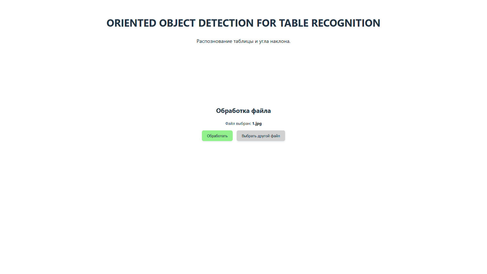

# Сервис для восстановления ориентации документов с повёрнутыми таблицами

Сервис был разработан в рамках Программной Инженерии 2025

http://158.160.162.140:5173/

### Что было реализовано:
- Модель, определяющая таблицу на скане и угол её поворота (взята с прошлого семестра)
- Backend, написан на Python
- Тесты для Backend
- Frontend, написан на React + TS
- Тесты для Frontend
- CI/CD, реализован с помощью GitHub Actions
- Разработка проводилась с подходом Trunk Based Development, с защитой main от пушей

### Описание Backend

[см. описание Backend](https://github.com/EliteHacker228/PE_2025/tree/main/backend)

### Описание Frontend

[см. описание Frontend](https://github.com/EliteHacker228/PE_2025/tree/main/frontend)

### Как работает сервис?

Через Frontend пользователь может загрузить изображение, содержащее таблиц. Далее, 
сервис проведёт обработку, и вернёт ему документ с восстановленной ориентацией

Например, имеется документ вида:

Его пользователь открыть сервис:

Загрузить в него документ:

И получить результат его работы - документ, с восставновленной ориентацией:

### GitHub Actions

Для обеспечения CI/CD были реализованы следующие экшены:
- Линтинг
  - Обеспечивается с помощью GitHub Super-Linter, предоставляющего линтеры для 
  Python (flake8 для pep8, black для стандарта black), React + TS, HTML, CSS, YML- и Dockerfile файлов
- Запуск тестов
    - Запускает тесты, написанные разработчиками для своих модулей. Для Backend и Frontend созданы отдельные экшены, 
  запускающие отдельные тесты
- Сборка и деплой
  - После прохождения ревью и мёрджа в main запускается сборка образов. Backend и Frontend собираются
  в докер образы и сохраняются в GitHub Container Registy
  - Затем собранные образы разворачиваются на сервере, развёрнутом на Yandex.Cloud
